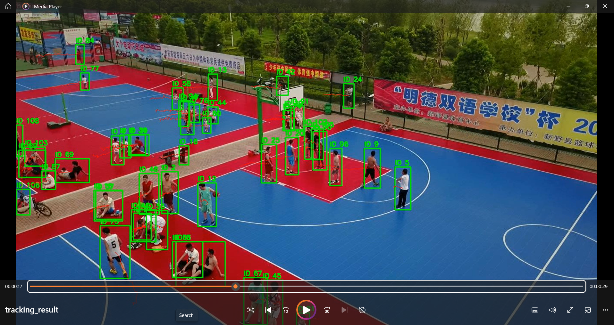

# 🛸 The Aerial Guardian
### Drone-Based Multi-Person Detection and Tracking

**Author:** Siddhant Roy  
**Dataset:** VisDrone 2019 MOT Validation Set (Task 4)

---

## Overview

A lightweight drone-based multi-person detection and tracking pipeline designed to address common challenges in aerial surveillance:

- **Small person sizes** in high-altitude drone footage
- **Camera motion** caused by drone movement
- **Consistent tracking IDs** across frames
- **Lightweight deployment** constraints (<300 MB)

### Pipeline
Frames → YOLOv8n → SAHI → Camera Motion Compensation → ByteTrack → Tracked Output Video

The final pipeline combines:
- [YOLOv8n](https://github.com/ultralytics/ultralytics) for person detection
- [SAHI](https://github.com/obss/sahi) for small-object detection through sliced inference
- [ByteTrack](https://github.com/ifzhang/ByteTrack) for multi-object tracking
- Camera Motion Compensation (CMC) using optical flow

---

## Repository Structure

```text
.
├── preprocess.py
├── data.yaml
├── botlab_assignment.py
├── botlab_sahi.py
├── weights/
│   └── best.pt
├── report/
│   └── aerial_guardian_Report.pdf
└── sample_output/
```

| File | Description |
|------|-------------|
| `preprocess.py` | Converts VisDrone MOT annotations into YOLOv8 format |
| `data.yaml` | YOLO dataset configuration |
| `botlab_assignment.py` | Training and evaluation notebook |
| `botlab_sahi.py` | Detection, tracking, SAHI, and CMC pipeline |
| `weights/best.pt` | Fine-tuned YOLOv8n model weights |

---

## Dataset

This project uses the [VisDrone 2019 MOT Validation Set](https://github.com/VisDrone/VisDrone-Dataset).

After downloading:

1. Place the dataset locally
2. Run `preprocess.py` to generate YOLO labels
3. Update `data.yaml` paths if required

---

## Installation

```bash
pip install ultralytics==8.4.54
pip install sahi
pip install supervision
pip install opencv-python
pip install Pillow
pip install gdown
```

---

## Pretrained Weights

The trained model weights are included in:

```text
weights/best.pt
```
---

### Training

Open and run `botlab_assignment.py`.

| Parameter | Value |
|-----------|-------|
| Base model | YOLOv8n |
| Epochs | 30 |
| Batch size | 16 |
| Image size | 640 |
| Hardware | NVIDIA T4 GPU (Google Colab) |

### Detection and Tracking

Open and run `botlab_sahi.py`.

---

## Results

| Metric | Value |
|--------|-------|
| Model Size | 6.2 MB |
| Average FPS (with CMC) | 3.41 |
| Average FPS (without CMC) | 3.86 |
| Total Frames Processed | 464 |
| Hardware | NVIDIA T4 GPU |

---

## Sample Output


*Example output showing person detections, track IDs and trajectory tails.*
---

### Output Videos

[Download Tracking Video ](sample_output/tracking_result.mp4)


### Note

> GitHub may not preview large video files directly. If preview is unavailable, download the video from the sample_output folder and click **View Raw**.
---
## Key Modifications

Compared to a standard YOLOv8 + ByteTrack pipeline, the following adaptations were made for the drone scenario:

- Fine-tuned YOLOv8n on VisDrone MOT person classes.
- Integrated SAHI sliced inference to improve small-object detection.
- Added Camera Motion Compensation (CMC) using optical flow to reduce tracking instability caused by drone movement.
- Added trajectory visualization for tracked targets.
- Maintained a lightweight deployment footprint (6.2 MB model size).
---

### Engineering Trade-off

SAHI significantly improved detection of small distant pedestrians, but increased inference time. The final solution prioritizes detection quality while maintaining a lightweight model size of 6.2 MB suitable for edge deployment scenarios.

---

## Report

Detailed implementation details, design decisions, experiments, and discussion:
[View Report](report/aerial_guardian_Report.pdf)

---

## Future Improvements

- [ ] Improve handling of heavy occlusions
- [ ] Re-train using improved validation splits
- [ ] TensorRT optimization for NVIDIA Jetson deployment
- [ ] Better support for top-down drone viewpoint.